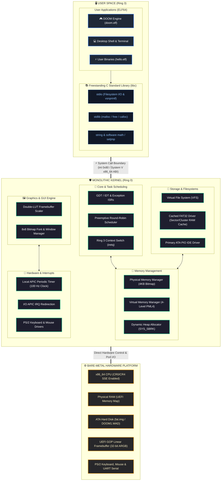

# MyOS — 64-Bit x86_64 Monolithic Operating System & DOOM Port

<div align="center">

[](https://github.com/codertoji-spec/MYOS)
[](https://github.com/codertoji-spec/MYOS)
[](https://github.com/codertoji-spec/MYOS)
[](https://github.com/codertoji-spec/MYOS)
[-red.svg?style=for-the-badge)](https://github.com/codertoji-spec/MYOS)

**A high-performance, freestanding 64-bit operating system engineered from scratch in C and x86_64 Assembly, featuring hardware memory management, preemptive scheduling, a cached FAT32 VFS, a graphical compositor, a freestanding C standard library, and a full user-mode port of classic DOOM.**

</div>

---

## 🏛️ System Architecture



---

## 🌟 Key Subsystems & Engineering Highlights

### 1. 🎛️ CPU Initialization & Privilege Separation (Ring 0 / Ring 3)
- **64-bit Long Mode Bootstrapping**: Booted via a custom 64-bit UEFI bootloader (`BOOTX64.EFI`) establishing identity paging and acquiring the UEFI Graphics Output Protocol (GOP) linear framebuffer.
- **GDT / IDT & Exception Handling**: Configured Global Descriptor Tables with Kernel and User Code/Data descriptors, Task State Segment (TSS), and 256-vector Interrupt Descriptor Table.
- **Hardware SSE / SIMD Vectorization**: Enabled hardware floating point and SSE instructions by clearing `CR0.EM`, asserting `CR0.MP`, and activating `CR4.OSFXSR` (bit 9) and `CR4.OSXMMEXCPT` (bit 10) to support compiler vectorization (`movaps`/`movups`).
- **System V x86_64 ABI Compliance**: Enforced strict 16-byte stack alignment (`RSP % 16 == 8` prior to function invocation) across user thread initialization and interrupt returns (`iretq`).

### 2. 🧠 Memory Management Architecture
- **Physical Memory Manager (PMM)**: High-performance bitmap allocator tracking individual 4KB physical pages across all available RAM descriptors reported by UEFI.
- **Virtual Memory Manager (VMM)**: Hierarchical 4-level paging (`PML4` -> `PDPT` -> `PD` -> `PT`) providing identity-mapped physical memory alongside isolated, user-space virtual address spaces.
- **Dynamic User Heap Allocation**: Kernel `SYS_SBRK` dynamically allocates and maps non-contiguous physical pages contiguously into the process's virtual heap.

### 3. ⏱️ Interrupts & Real-Time APIC Clock
- **Local APIC Periodic Timer**: Calibrated at 100 Hz (10 ms period) to drive preemptive scheduling and deliver accurate real-time clock timestamps via `SYS_GETTICKS`.
- **I/O APIC Routing**: Interrupt redirection table routing hardware IRQ lines (PS/2 Keyboard IRQ 1, Mouse IRQ 12) directly to Local APIC interrupt vectors.

### 4. 💾 Storage & Cached FAT32 Virtual File System (VFS)
- **ATA PIO IDE Driver**: Direct port I/O disk sector reading and writing.
- **Sector & Cluster RAM Caching**: Implemented transparent FAT sector buffer caching and cluster lookups, eliminating redundant disk I/O when streaming multi-megabyte binary assets (e.g. `DOOM1.WAD`).

### 5. 📚 Freestanding C Standard Library (`libc`)
Custom-built runtime library enabling standard C application compilation:
- **`stdio`**: POSIX file descriptor table, `fopen`, `fread`, `fwrite`, `fseek`, `ftell`, `fclose`, and a formatting engine (`vsnprintf`/`snprintf`) supporting `%d`, `%u`, `%x`, `%p`, `%s`, and custom width/precision/zero-padding (`%.3d`, `%03d`).
- **`stdlib` / `string`**: `malloc`, `free`, `calloc`, `realloc`, `memmove`, `memcpy`, `strncmp`, `strncasecmp`, `strrchr`, `strstr`.
- **`math`**: Software floating-point functions (`sin`, `cos`, `tan`, `sqrt`, `fabs`, `floor`, `ceil`, `pow`, `atan2`).
- **`setjmp`**: Assembly implementation of `setjmp` and `longjmp` for non-local control flow.

### 6. 🖼️ Framebuffer Compositor & DOOM Graphics Engine
- **Double-LUT Nearest-Neighbor Scaler**: High-performance scaling algorithm using precomputed horizontal (`doom_x_table`) and vertical (`doom_y_table`) lookup tables to blit 640×400 game frames to high-resolution display outputs with zero division overhead.
- **Real-Time Physics Lock**: Synchronized game ticks to exact 35.0 FPS physics tickrate.
- **Full Hardware Key Event Pipeline**: Interrupt-driven key queue routing scancodes directly to DOOM actions (<kbd>W</kbd><kbd>A</kbd><kbd>S</kbd><kbd>D</kbd>, Arrows, <kbd>Ctrl</kbd> to Shoot, <kbd>Space</kbd> to Use, <kbd>Enter</kbd>, <kbd>Esc</kbd>).

---

## 🕹️ System Call Interface (`int 0x80`)

| Vector | Syscall | Arguments | Return Value | Description |
|:---:|:---|:---|:---|:---|
| `1` | `SYS_PRINT` | `RBX`: string pointer | `0` on success | Writes null-terminated string to terminal/serial |
| `2` | `SYS_EXIT` | `RBX`: exit code | `—` | Terminates calling thread and frees resources |
| `3` | `SYS_OPEN` | `RBX`: path string | File Descriptor (`0-7`) | Opens file from FAT32 filesystem |
| `4` | `SYS_READ` | `RBX`: fd, `RCX`: buffer, `RDX`: bytes | Bytes read | Reads bytes from open file descriptor |
| `5` | `SYS_SEEK` | `RBX`: fd, `RCX`: offset, `RDX`: whence | New offset | Adjusts read/write file pointer |
| `6` | `SYS_CLOSE` | `RBX`: fd | `0` on success | Closes open file descriptor |
| `7` | `SYS_BLIT` | `RBX`: frame buffer ptr | `0` on success | Renders 640×400 ARGB frame to screen |
| `8` | `SYS_GETKEY` | *None* | `(pressed << 8) \| keycode` | Retrieves queued keyboard event |
| `9` | `SYS_SBRK` | `RBX`: increment size | Previous heap top ptr | Expands user process virtual heap |
| `10` | `SYS_GETTICKS` | *None* | Milliseconds | Returns elapsed real-time milliseconds (100 Hz) |

---

## 🎮 Game Controls (DOOM)

| Action | Controls |
|---|---|
| **Fire Weapon / Shoot** | <kbd>Ctrl</kbd> |
| **Move Forward / Backward** | <kbd>W</kbd> / <kbd>S</kbd> or <kbd>↑</kbd> / <kbd>↓</kbd> |
| **Turn Left / Right** | <kbd>A</kbd> / <kbd>D</kbd> or <kbd>←</kbd> / <kbd>→</kbd> |
| **Open Doors / Activate** | <kbd>Space</kbd> or <kbd>E</kbd> |
| **Run / Speed** | <kbd>Shift</kbd> |
| **Select Weapon** | <kbd>1</kbd> – <kbd>7</kbd> |
| **Game Menu / Pause** | <kbd>Esc</kbd> |
| **Menu Select** | <kbd>Enter</kbd> |
| **Automap** | <kbd>Tab</kbd> |

---

## 🛠️ Building & Running

### Prerequisites
- **Docker Desktop** (for reproducible Linux cross-compilation toolchain: Clang, LLD, mtools, dosfstools).
- **VirtualBox** (or **QEMU**) with UEFI support.

### 1. Build the OS & Package Binaries
```bash
# Build kernel, libc, user binaries, and generate FAT32 disk image
docker run --rm -v "${PWD}:/os" os-builder make -B iso
```

### 2. Run in VirtualBox
```bash
# Convert raw disk to VDI and start VM
VBoxManage convertfromraw build/fat.img build/fat.vdi --format VDI
VBoxManage storageattach "MyOS" --storagectl "IDE" --port 0 --device 0 --type hdd --medium build/fat.vdi
VBoxManage startvm "MyOS"
```

### 3. Launching DOOM
Once the desktop graphical terminal loads, type:
```bash
myos$ run doom.elf
```

---

## 📂 Repository Structure

```text
.
├── Makefile                     # Build system orchestration
├── Dockerfile                   # Hermetic build environment
├── kernel/                      # Ring 0 Monolithic Kernel
│   ├── core/                    # Kernel entry, main, GDT, IDT
│   ├── arch/x86_64/             # Low-level ISR assembly stubs & syscalls
│   ├── hw/                      # Hardware drivers (APIC, IOAPIC, Keyboard, Mouse, ATA)
│   ├── mm/                      # Memory management (PMM, VMM, Kernel Heap)
│   ├── fs/                      # VFS layer & FAT32 driver
│   ├── gui/                     # GOP Linear Framebuffer Compositor & Font
│   ├── shell/                   # Graphical shell and terminal emulator
│   └── task/                    # Thread structures and preemptive scheduler
├── programs/                    # Ring 3 User Space
│   ├── libc/                    # Freestanding C standard library
│   │   ├── include/             # stdio.h, stdlib.h, string.h, math.h, syscall.h
│   │   └── setjmp.S             # x86_64 setjmp / longjmp implementation
│   ├── doom/                    # DOOM port (doomgeneric + MyOS platform backend)
│   │   ├── doomgeneric_myos.c   # Platform driver (Syscalls 7, 8, 10)
│   │   └── DOOM1.WAD            # Shareware game data lump file
│   └── hello/                   # User-mode test application
└── build/                       # Output artifacts (fat.img, kernel.elf, doom.elf)
```

---

## 📜 License
This project is open-source under the MIT License. DOOM and `DOOM1.WAD` are copyright © id Software / ZeniMax Media Inc.